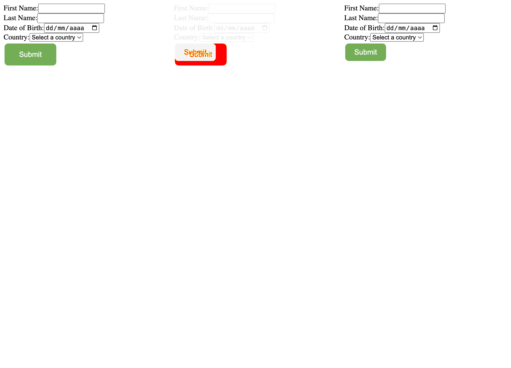
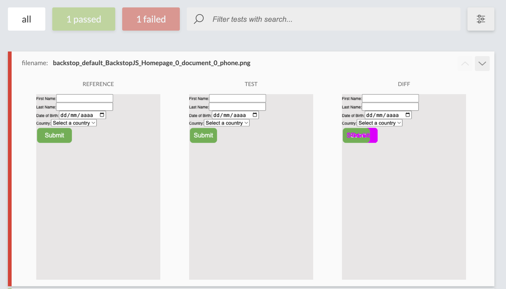

# poc-css-testing

The intent of this repository is to test and compare different approaches for testing UI, CSS and styles in general.

## What are we comparing?

- Performance (how long does it take to run the tests)
- Resistance to refactor (how hard it is to update the tests after code changes)
- Automation (how automated each strategy is, with less human interaction needed)
- How accurate are the tests (less false positives / false negatives)

### Cypress Image Snapshot

- Original lib (https://github.com/jaredpalmer/cypress-image-snapshot) very outdated (last update was in 2021)
- Fork from original lib being mantained (https://github.com/simonsmith/cypress-image-snapshot)
- Cypress comes up with several presets, which can be used to test across different viewports: https://docs.cypress.io/api/commands/viewport#Arguments

Using the presets, we can do many automated assertions among different device sizes and get the delta on the changes in a visual way:

```javascript
export const sizes = [
  "ipad-2",
  "ipad-mini",
  "iphone-x",
  "iphone-xr",
  "macbook-13",
  "macbook-15",
  "samsung-note9",
  "samsung-s10",
];

describe("<UserForm />", () => {
  sizes.forEach((size) => {
    it(`renders on ${size}`, () => {
      cy.viewport(size);

      cy.mount(<UserForm />);

      cy.matchImageSnapshot(`user-form-${size}`);
    });
  });
});
```



### BackstopJS

- Support for multiple viewports in config file
- URL centric
- Centralized in config file
- Several easy to use setup options for each scenario

```javascript
  "viewports": [
    {
      "label": "phone",
      "width": 320,
      "height": 480
    },
    {
      "label": "tablet",
      "width": 1024,
      "height": 768
    }
  ],

    "scenarios": [
    {
      "label": "BackstopJS Homepage",
      "cookiePath": "backstop_data/engine_scripts/cookies.json",
      "url": "http://localhost:3000/",
      "referenceUrl": "",
      "readyEvent": "",
      "readySelector": "",
      "delay": 0,
      "hideSelectors": [],
      "removeSelectors": [],
      "hoverSelector": "",
      "clickSelector": "",
      "postInteractionWait": 0,
      "selectors": [],
      "selectorExpansion": true,
      "expect": 0,
      "misMatchThreshold": 0.1,
      "requireSameDimensions": true
    }
  ],
```


